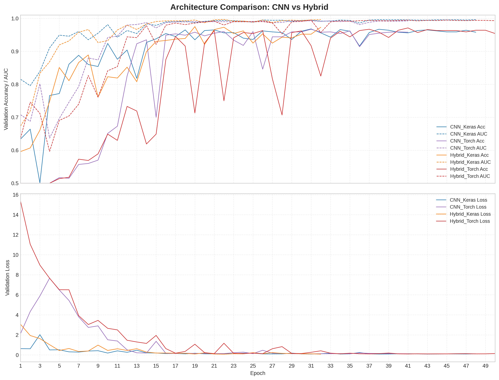
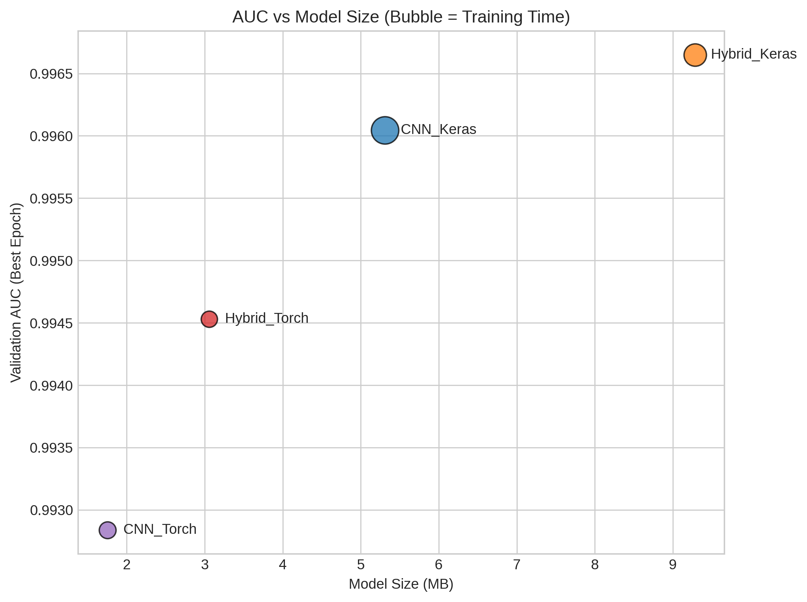

# CNN vs CNN-ViT Hybrid Architectures for Satellite Crop Classification

### Cross-Framework Comparison in Keras and PyTorch

Experimental comparison of convolutional and hybrid transformer architectures for satellite crop classification using the EuroSAT dataset, implemented in both TensorFlow/Keras and PyTorch.


%20%7C%20PyTorch-orange)


---

## Quick Summary
>**Task:** Satellite crop classification (EuroSAT)  
>**Problem Type:** Image binary classification (Annual Crop vs Permanent Crop)  
>**Architectures:** CNN vs CNN-ViT Hybrid  
>**Frameworks:** TensorFlow/Keras vs PyTorch  
>**Best Model:** Hybrid CNN-ViT (Keras)  
>**Best Accuracy:** 97.3%

---

This project explores the performance of **Convolutional Neural Networks (CNNs)** and **CNN–Vision Transformer (CNN-ViT) hybrid architectures** for satellite image classification using the **EuroSAT dataset**.

The goal is twofold:

1. **Architectural comparison**
   Evaluate whether integrating Transformer attention into CNN models improves classification performance.

2. **Framework comparison**
   Implement equivalent architectures in **Keras (TensorFlow)** and **PyTorch** to analyze differences in training dynamics, computational efficiency, and predictive performance.

The study focuses on **binary classification of annual vs permanent crops**, using RGB satellite imagery.

---

# Project Highlights

* End-to-end **modular deep learning pipeline**
* **Cross-framework implementation** (Keras & PyTorch)
* Comparison of **CNN baseline vs CNN-ViT hybrid architecture**
* Reproducible experiments with saved models, metrics, and training logs
* Comprehensive **evaluation and visualization of results**

---

# Dataset

This project uses the **EuroSAT RGB dataset**, a widely used benchmark for land use and land cover classification based on Sentinel-2 satellite imagery.

Binary classification task:

* **Annual Crop**
* **Permanent Crop**

Images are resized to **64×64 RGB** for training.

Dataset source:

https://zenodo.org/records/7711810

---

# Notebooks

The project is organized into four main notebooks:

1. **Data Pipeline** – dataset preparation, preprocessing, and visualization
2. **CNN Baseline Models** – baseline convolutional architectures in Keras and PyTorch
3. **CNN-ViT Hybrid Models** – hybrid convolution + transformer architectures
4. **Comparative Analysis** – cross-framework and cross-architecture evaluation

---

# Model Architectures Overview

## CNN Baseline

A lightweight convolutional architecture designed to capture **local spatial features** from satellite imagery.

Both the Keras and PyTorch implementations follow an identical structure:

* **Four convolutional blocks** with progressive feature expansion
  *(32 → 64 → 128 → 256 channels)*
* **Batch normalization** after each convolution
* **Max pooling** for spatial downsampling
* **Global average pooling** for compact feature aggregation
* **Fully connected classification head**

This design provides a strong convolutional baseline while maintaining computational efficiency.

---

## CNN-ViT Hybrid

The hybrid model extends the CNN baseline by introducing **Vision Transformer encoder blocks** to capture global spatial relationships.

Architecture overview:

* **Three convolutional blocks** *(32 → 64 → 128 channels)* for feature extraction
* Spatial reduction to an **8 × 8 feature map**
* Reshaping into **64 tokens (8 × 8 grid)**
* **Learnable positional embeddings**
* **Two Transformer encoder blocks**
* Reshaping back to spatial format
* **Final convolutional block (256 channels)**
* **Global average pooling**
* **Fully connected classification head**

This hybrid design preserves CNN **local inductive bias** while enabling **global contextual modeling through self-attention**.

---

# Experimental Setup

Four models were trained and evaluated:

| Model          | Framework |
| -------------- | --------- |
| CNN Baseline   | Keras     |
| CNN Baseline   | PyTorch   |
| CNN-ViT Hybrid | Keras     |
| CNN-ViT Hybrid | PyTorch   |

Evaluation metrics:

* Accuracy
* Precision
* Recall
* F1 Score
* AUC
* Loss

Early stopping and learning rate scheduling were applied to ensure stable convergence.

---

# Methodology

To ensure a fair comparison between frameworks and architectures, the experiments were designed to minimize confounding variables.

Key alignment decisions included:

* **Identical dataset splits** across all experiments
* **Equivalent model architectures** implemented in both frameworks
* Matching **optimizer configuration and learning rate schedules**
* Comparable **data augmentation strategies**
* Consistent **evaluation metrics and validation procedures**

Both CNN and CNN-ViT hybrid models were trained under the same conditions, allowing differences in performance to be attributed *primarily* to **architectural design or framework implementation characteristics**, rather than experimental inconsistencies.

Early stopping and learning rate scheduling were used to ensure stable convergence and prevent overfitting.

The objective was not to enforce bit-level reproducibility across frameworks, which is not feasible due to internal numerical differences, but rather to achieve **methodological rigor and experimental comparability**.

---

# Results

| Model            | Best Epoch | Accuracy   | Precision  | Recall     | F1         | AUC        | Loss       |
| ---------------- | ---------- | ---------- | ---------- | ---------- | ---------- | ---------- | ---------- |
| CNN (Keras)      | 38         | 0.967      | 0.953      | 0.982      | 0.968      | 0.996      | 0.087      |
| CNN (PyTorch)    | 31         | 0.967      | 0.966      | 0.968      | 0.967      | 0.993      | 0.106      |
| Hybrid (Keras)   | **22**     | **0.973**  | 0.959      | **0.988**  | **0.973**  | **0.997**  | **0.074**  |
| Hybrid (PyTorch) | 41         | 0.971      | **0.966**  | 0.976      | 0.971      | 0.995      | 0.096      |

### Training Dynamics Comparison

Validation accuracy, AUC, and loss across training epochs for all model variants.



---

# Key Insights

The experiments isolate the effects of **architecture choice (CNN vs CNN-ViT hybrid)** and **framework choice (Keras vs PyTorch)** under closely aligned experimental conditions.

Results indicate that **architecture selection primarily determines predictive performance**, while **framework choice mainly affects computational efficiency**.

Hybrid CNN-ViT models consistently achieved higher **recall and AUC**, suggesting that combining convolutional feature extraction with global self-attention improves representation learning for satellite imagery.

Across both architectures:

* **Keras implementations achieved slightly lower loss and marginally higher AUC**
* **PyTorch implementations trained faster and produced smaller model files**

Despite these differences, all models achieved **very high predictive performance**, confirming that both frameworks are suitable for practical deep learning pipelines in remote sensing applications.

### Performance vs Model Efficiency

Relationship between model size and predictive performance. Bubble size represents training time.



---

# Practical Recommendations

The optimal model depends on the deployment objective.

**Hybrid_Keras**

* Best overall predictive performance
* Highest AUC and recall
* Recommended when minimizing **false negatives** is critical

**Hybrid_Torch**

* Best balance between **performance and computational efficiency**
* Near-top accuracy and AUC
* Faster training and smaller model size

**CNN_Torch**

* Most **efficient baseline**
* Simplest architecture
* Suitable for constrained environments

In summary, **architecture selection primarily determines predictive strength**, while **framework choice primarily affects computational efficiency**.

---

# Limitations

Although strong care was taken to ensure equivalence between frameworks, exact computational parity is not fully attainable.

The Keras and PyTorch implementations were aligned as closely as possible in terms of architecture, hyperparameters, optimizer configuration, learning rate scheduling, and data splits. However, small differences may still arise due to framework-specific numerical implementations, backend libraries, weight initialization behavior, or GPU execution order.

Data augmentation pipelines were conceptually aligned, but minor differences in preprocessing or randomness handling may introduce slight variations in effective training data.

Finally, results were obtained on a **single dataset (EuroSAT)**. While internally consistent, performance differences may vary when applied to other datasets or domains.

---

# Repository Structure

```
cnn-vs-cnnvit-eurosat/
│
├── README.md
├── requirements.txt
├── .gitignore
│
├── notebooks/
│   ├── 01_data_pipeline.ipynb
│   ├── 02_cnn_baseline_models.ipynb
│   ├── 03_cnn_vit_hybrid_models.ipynb
│   └── 04_comparative_analysis.ipynb
│
├── src/
|   ├── baseline_models.py
│   ├── data.py
│   ├── data_pipeline_viz.py
│   ├── hybrid_models.py
│   ├── train_keras.py
│   ├── train_torch.py
│   ├── training_plots.py
│   ├── evaluation_utils.py
│   ├── general_eval.py
│   └── model_load_eval.py
│
├── models/
│   ├── keras/
│   │   ├── keras_cnn_baseline.keras
│   │   └── keras_hybrid.keras
│   │
│   └── pytorch/
│       ├── pytorch_cnn_baseline.pth
│       └── pytorch_hybrid.pth
│
├── results/
│   ├── metrics/
│   │   ├── final_metrics.csv
│   │   ├── metadata_comparison.csv
│   │   └── gap_best_epoch.csv
│   │
│   ├── training_logs/
│   │   ├── keras_cnn_baseline_history.json
│   │   ├── keras_cnn_baseline_metadata.json
│   │   ├── pytorch_cnn_baseline_history.json
│   │   ├── pytorch_cnn_baseline_metadata.json
│   │   ├── keras_hybrid_history.json
│   │   ├── keras_hybrid_metadata.json
│   │   ├── pytorch_hybrid_history.json
│   │   └── pytorch_hybrid_metadata.json
│   │
│   └── figures/
|       ├── accuracy_vs_time.png
│       ├── roc_comparison.png
│       ├── architecture_comparison_plot.png
│       ├── baseline_models_plot.png
│       ├── hybrid_models_plot.png
│       ├── generalization_gap_plot.png
│       ├── parameter_comparison.png
│       ├── model_size_comparison.png
│       ├── training_time_comparison.png
│       ├── auc_vs_model_size.png
│       ├── auc_vs_params.png
│       ├── confusion_matrix_grid_norm.png
│       └── confusion_matrix_grid_nonorm.png
│
└── data/
    └── README.md
```

---

# Reproducibility

To reproduce the experiments:

```
pip install -r requirements.txt
```

Run the notebooks sequentially:

1. Data Pipeline
2. CNN Baseline Models
3. CNN-ViT Hybrid Models
4. Comparative Analysis

---

# Development Environment

The experiments in this project were developed and executed primarily using **Kaggle Notebooks**.

Kaggle provides a convenient environment for:

* GPU-enabled training
* dataset hosting
* experiment reproducibility

Because of this, some file paths in the notebooks are configured for the Kaggle directory structure.

If you run the notebooks locally, you may need to adjust dataset and output paths accordingly (for example replacing Kaggle input paths with local directories).

---

# Conclusion

This project provides a controlled comparison of **CNN and CNN-ViT hybrid architectures implemented in both Keras (TensorFlow) and PyTorch**, applied to a binary classification task distinguishing **annual versus permanent crop images from the EuroSAT dataset**.

The analysis evaluates predictive performance, generalization behavior, and computational efficiency while keeping experimental conditions as aligned as possible across frameworks.

Results show that hybrid architectures consistently improve recall and AUC, while framework differences mainly influence training efficiency and model size rather than predictive capability.

Overall, the findings demonstrate that **architecture choice has a stronger influence on predictive performance than framework choice**, while both frameworks provide robust tooling for applied deep learning in satellite image classification.

The repository also serves as a **reproducible experimental pipeline** that can be extended with additional datasets, architectures, or experimental settings.

---

# Author
**Filipe Braiman Carvalho**  
Applied AI & LLM Systems | Deep Learning · Transformers · RAG · Computer Vision | End-to-End ML Engineering

**Email:** [filipebraiman@gmail.com](mailto:filipebraiman@gmail.com)  
**LinkedIn:** [linkedin.com/in/filipe-b-carvalho](https://www.linkedin.com/in/filipe-b-carvalho)  
**GitHub:** [github.com/filipe-braiman](https://github.com/filipe-braiman)  

## About Me  
AI and data professional with experience in **LLM evaluation, retrieval-augmented generation (RAG), and AI model validation**. Currently working in **AI R&D at Huawei as an AI Evaluation Specialist**, contributing to the reliability and real-world performance of LLM and RAG systems. Strong background in **Python-based data and AI workflows**, including model assessment, dataset development, and analytical reporting for production-oriented AI solutions. Portfolio projects explore **deep learning architectures, computer vision, RAG systems, and applied machine learning experimentation**, emphasizing reproducible ML pipelines and practical AI engineering.

---

## Version History

| Version | Date       | Changes                |
| :------ | :--------- | :--------------------- |
| 1.0     | 2026-03-08 | First publication.     |
